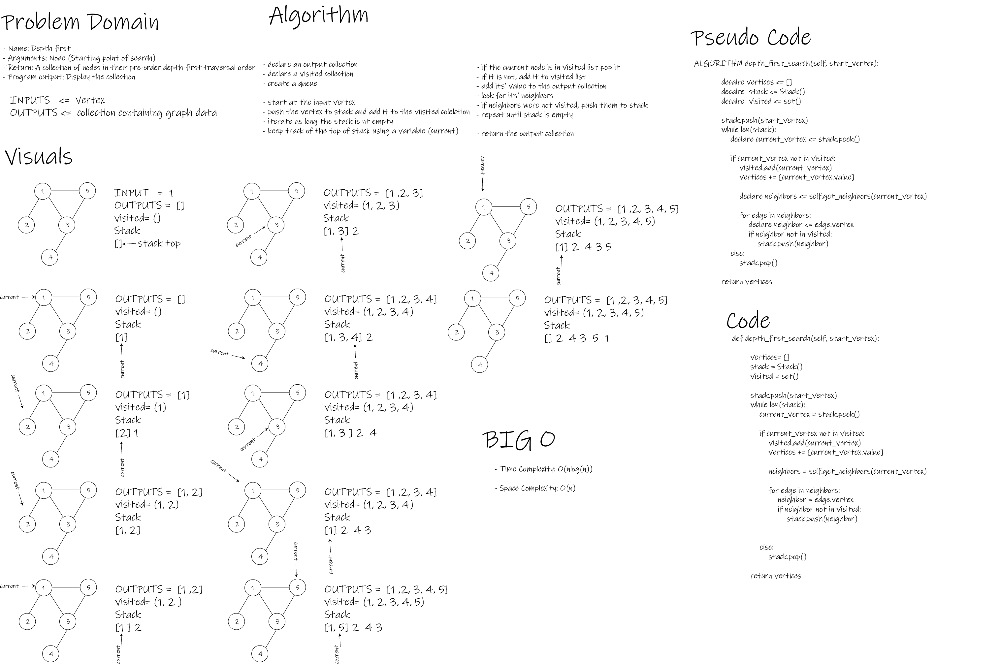

# Graph - graph-breadth-first - business-trip - graph-depth-first

- This Module provides means to create Graph Data Structure and modify them to some extent.

 

## Challenge

- To implement new data-structure and manipulate it.

 

## Whiteboard Process

- depth_first_search

 

- business_trip

 

- graph-depth-first

 

## Approach & Efficiency

- O complexity (Time and Space) for (Graph.size) method is O(1).

- O complexity (Time and Space) for (Graph.add_vertex) method is O(1).

- O complexity (Time and Space) for (Graph.add_edge) method is O(1).

- O complexity (Time) for (Graph.get_vertices) method is O(n).
- O complexity (Space) for (Graph.get_vertices) method is O(1).

- O complexity (Time) for (Graph.breadth_first_search) method is O(nlog(n)).
- O complexity (Space) for (Graph.breadth_first_search) method is O(n).

- O complexity (Time) for (Graph.depth_first_search) method is O(nlog(n)).
- O complexity (Space) for (Graph.depth_first_search) method is O(n).

- O complexity (Time) for (business_trip) function is O(n^2).
- O complexity (Space) for (business_trip) function is O(1).

 

## API

- Graph()
            Graph class creates Graph instances.

            Arguments:None

- Graph.size()

            This method returns the length of the graph.

            Arguments: None

            Return: int

- Graph.add_vertex()

            This method adds a vertex to the graph.

            Arguments: vertex value

            Return: vertex

- Graph.add_edge()

            This method adds an edge between two graph vertices.

            Arguments:
            start_vertex: Vertex
            end_vertex: Vertex
            weight: int

            Return: None

- Graph.get_vertices()

            This method returns graph vertices

            Arguments: None

            Return: list of keys

- Graph.get_neighbors()

            This method returns vertix neighbors

            Arguments: vertex

            Return: list of vertices

- Graph.breadth_first_search()

            This method traverses a graph in breadth first order performing an action on each vertex.

            Arguments:

            start_vertex: Vertex

            action: a function

            Return: None

- Graph.depth_first_search()

            This method traverses a graph in depth first order performing an action on each vertex.

            Arguments:

            start_vertex: Vertex

            action: a function

            Return: None

- business_trip()

            business_trip calculates if trips between cities are possible and calculates their total cost.

            Arguments:
            graph: graph of available flights and their costs
            array: an array containing destinations

            Return: Str, the cost or None

 

## Testing Goals

- Graph

- [x] Node can be successfully added to the graph
- [x] An edge can be successfully added to the graph
- [x] A collection of all nodes can be properly retrieved from the graph
- [x] All appropriate neighbors can be retrieved from the graph
- [x] Neighbors are returned with the weight between nodes included
- [x] The proper size is returned, representing the number of nodes in the graph
- [x] A graph with only one node and edge can be properly returned
- [x] An empty graph properly returns null

-------------------------------------------------------------------------------

- breadth_first_search

- [x] Successfully returns a collection of graph vertices values
- [x] Successfully handles graphs with single vertex
- [x] Successfully raises exceptions on input errors

-------------------------------------------------------------------------------

- business_trip

- [x] Successfully returns the cost for a valid flight path
- [x] Successfully returns the cost for an invalid flight path
- [x] Successfully returns the cost for an invalid flight path that come after valid ones
- [x] Successfully raises exceptions on input errors

-------------------------------------------------------------------------------

- depth_first_search

- [x] Successfully returns a collection of graph vertices values
- [x] Successfully handles graphs with single vertex
- [x] Successfully raises exceptions on input errors
