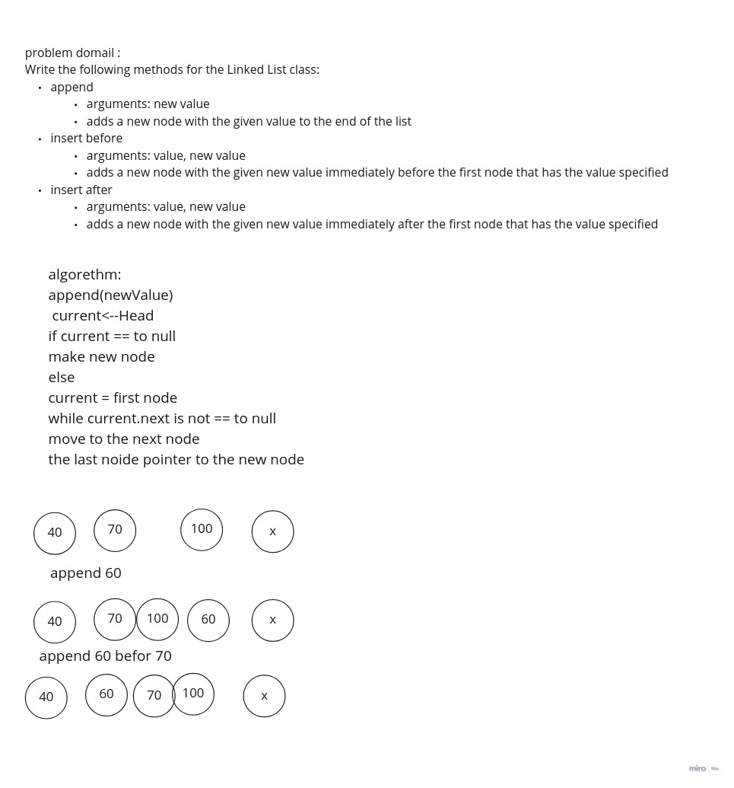

# Challenge Summary
challenge has to build 3 methods:
1. append: to insert node at end
2. insert before: to insert node before specific node
3. insert after: to insert node after specific node

## Whiteboard Process

## Solution
1. append--->

        original= "{ hi } -> { 60 } -> { 100 } -> NULL"
        linkedlist.append(4)
        expected = "{ hi } -> { 70 } -> { 100 } -> { 4 } -> NULL"

[PRlink](./Untitled.jpg)
